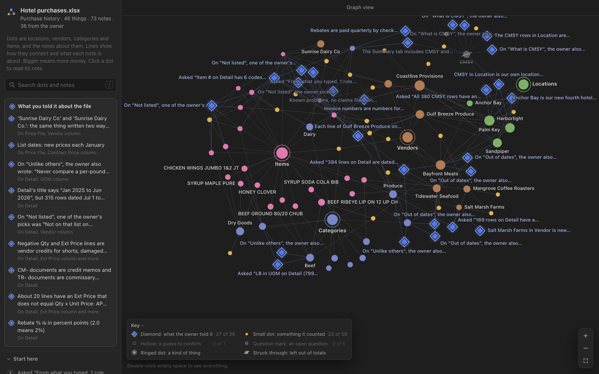
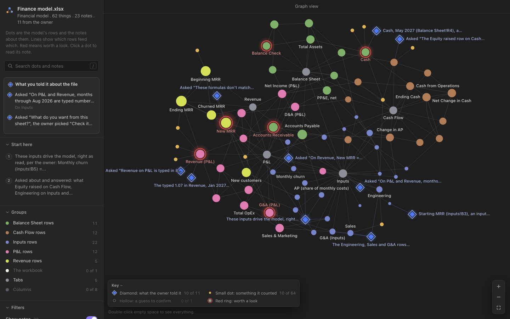

# Sheet Geek

**Your AI doesn't know what correlates to what in your spreadsheet. Now it can.**

An open-source skill that gives any spreadsheet a brain. The first time your AI opens a sheet, it studies the data with code, asks you only the handful of questions the data can't answer, and writes what it learned into a tab inside the file. Next time anyone opens that file with any AI, it starts from there. Nobody re-explains the sheet, and nothing lives only in one person's head.

Sheet Geek was called spreadsheet-brain through version 0.2.0. The studies below tested 0.2.0 under that name (tag [`v0.2.0`](https://github.com/Actual-Intelligence-Labs/sheet-geek/tree/v0.2.0)); 0.2.1 renames it; how it reads, asks and writes is unchanged. The `_brain` tab keeps its format label, `spreadsheet-brain 0.1`, so every brain reads the same.



## What happens

1. **It reads everything first.** Every row, with code. There is no "I can only look at 150 rows." It finds the tables, the keys, which columns match across tabs and files, what each formula feeds, and anything odd.
2. **It tells you what it found in five lines.** What the sheet is, what one row is, the scope, the money, the connections, what's worth a look.
3. **It asks a handful of questions, not thirty.** Four to start, then more in small rounds only when the data or your answers call for them, ten at most, and one open question at the end. Only what code can't know: your goal, what a number really means, what to leave out, whether the data is complete, and what only you know about it. Every question carries its reason and, when the data supports one, a recommended answer.
4. **It pitches what it can build.** An audit, a savings list, a guide for the next person, a plan to turn the sheet into an app. Ranked for your goal.
5. **It writes the brain into the file.** A `_brain` tab at the end: what each column means, how things connect, what you told it, what it counted, and what it's only guessing. Every note is labeled and dated. Your data is never touched, and it checks that.
6. **It draws the map.** A clickable, Obsidian-style graph of what connects to what. It works offline, from one HTML file.
7. **It stays current.** Reopen the file next month and it says, in one line, what changed and which of your notes might be out of date.

## Why it's different

- **The brain travels inside the file.** Email it, drop it in Drive, upload it to claude.ai or ChatGPT: the knowledge goes with it. Hand the file to a coworker, your accountant or an investor, and their AI starts from what you told yours. Links to your other spreadsheets carry only a name and a matching column, so sending one sheet never leaks the others.
- **Code conducts, the model is the voice.** Which question to ask, how to word it, which option to recommend, every number: all code. That is why it works on smaller models too, not just the biggest one.
- **It knows the difference between what you said, what it counted, and what it guessed.** Guesses stay marked as guesses until someone confirms them.
- **Private stays private.** Say "between us, Dave always rounds up" and that remark is kept on your machine, not written into the file you'll send to Dave.

## Try it first

[`demo/try-it/`](demo/try-it/) has two fake workbooks, a SaaS finance model and a hotel's purchases, each with and without a brain, plus its map. Give both versions to any AI, ask the same question, and compare. The brains were built by version 0.2 with an AI playing the owner from a written brief. Both files are among the seven practice files version 0.2 was developed on, so they show it at its best; the results under "How it was tested" come from twelve businesses it never saw. The chat runs quoted in the launch film are in [`evals/film-chat-runs/`](evals/film-chat-runs/).

## Install

**Claude Code**
```
/plugin marketplace add Actual-Intelligence-Labs/sheet-geek
/plugin install sheet-geek@sheet-geek
```
Then open any spreadsheet in the conversation, or just name one.

**claude.ai, Claude desktop:** download `sheet-geek.zip` from Releases, then Settings > Capabilities > Skills > Upload.

**ChatGPT (Work mode):** download `sheet-geek.zip` from Releases, then Customize > Skills > Add > Upload from your computer. Or skip the upload: in a Work chat, attach your spreadsheet and paste this repo's link, and ChatGPT clones it and runs it. Then say "Give this spreadsheet a brain" (or type `@sheet geek`). A plain "take a look" may not start it.

**Codex, Cursor, VS Code Copilot, Gemini CLI, and other tools that load Agent Skills:** copy `skills/sheet-geek` into the tool's skills folder (for example `.agents/skills/`), and add the snippet from `adapters/` for your tool.

**Chat apps without code (ChatGPT's regular Chat mode, Gemini Gems, Copilot agents):** paste the prompt in [`references/portable-prompt.md`](skills/sheet-geek/references/portable-prompt.md). It carries the method without the code.

Requirements: Python 3.10+ and `openpyxl`. CSV needs nothing else. Works offline.

## Things to ask

- "Give this spreadsheet a brain."
- "What does each column in this workbook mean?"
- "Make a data dictionary for this sheet."
- "I'm handing this file to a new bookkeeper. What will they get wrong?"
- "How do these two spreadsheets connect?"
- "Did anything change since the brain was saved?"
- "Show me the map."

The skill runs when a request is about understanding, documenting, auditing or handing over a spreadsheet, or when a file already has a `_brain` tab. It does not run on every spreadsheet you mention.

## What works where

| | Read a brain | Run the questions | Write the brain | Map |
|---|---|---|---|---|
| Claude Code | Yes, loads automatically | Yes, structured questions | Yes, in place with a backup | Opens in your browser |
| claude.ai (skill) | Expected | Expected, as text | Expected, as a copy you download | Expected, as an HTML file |
| ChatGPT (Work mode) | Yes, even without the skill | Yes, as text | Yes, as a copy you download | Yes, as an HTML file |
| Codex, Cursor, VS Code, Gemini CLI | Expected | Expected | Expected | Expected |
| ChatGPT Chat mode, Gemini, Copilot (prompt only) | Usually, if it lists the tabs | Lighter version | You paste a table it gives you | No |

Tested so far: Claude Code on macOS, and ChatGPT Work mode with GPT-6.1 Sol (2026-09-30: on the demo finance model it read the file, asked the same questions, saved the brain into a copy with every original cell unchanged, drew the map, and the brain read back cleanly in Claude; given only this repo's link, it cloned the repo and did the same; a fresh ChatGPT chat with no skill read a brain made in Claude and used the owner's notes). One difference: notes marked "this machine only" live in ChatGPT's temporary workspace and are gone when the chat ends. "Expected" means the tool loads the same open skill format and should work; it becomes "Yes" when someone runs it.

## What goes in the file, what stays home

| In the `_brain` tab (travels) | On your machine only (`~/.sheet-geek`) |
|---|---|
| What each column means, units, what one row is | Remarks about people, clients or deals |
| Rules for reading it ("credits count, transfers don't") | Business terms you mention: contract prices, markups, rebate rates (unless you choose to include them) |
| How tabs and columns connect | Your raw answers |
| Counted insights, dated | Backups of the file |
| The other files it links to: name and matching column only | The full map between your files |

The tab is visible by default so people without AI can read it too. Hidden is an option, but hidden is not private.

## What it reads, writes and sends

- **Reads:** the spreadsheets you share or name, every row, with code on your own machine (or in your AI app's sandbox), and its own local index (below). Nothing else on your computer.
- **Writes:** the `_brain` tab inside your file (or inside a copy, when you ask for one or the file is an upload), a backup of the file before each write, and the local index in `~/.sheet-geek`: private notes, raw answers, backups and the map between your files. Exports and the map are new files where you ask for them. Your data cells are never changed.
- **Sends:** nothing. The code makes no network calls and has no telemetry or usage tracking. Web research is off unless you say yes to it: your AI app runs the searches with its own web tool, and code first blocks any search that contains a value from your data. The map is one offline HTML file with a content security policy that blocks network access; it opens in your browser.
- **Claude Code session hooks** (Claude Code only): at the start of a session, a hook reads the local index and mentions, in one line each, up to five files under the current folder that already have a brain. When a message names an `.xlsx`, `.xlsm` or `.csv` path that exists, a hook reads that file's `_brain` tab (or, if the file has none, its brain in the local index) and adds a short summary of it to the conversation. Hooks never change your files and never send anything. They open the local index, which creates `~/.sheet-geek` if it isn't there yet, and record a new path when a file with a brain has moved.
- **Credit:** the brain's first note ends with "Made with Sheet Geek by Actual Intelligence Labs (actualintelligencelabs.ai)", and its meta row names the tool version. It is a plain fact, like a "generator" tag, with no link tracking and no ID for you or your file.

Your AI app keeps its own conversation history under its own policy. Answers you type during the questions are part of that conversation. More in [SECURITY.md](SECURITY.md).

## The format

The brain is a plain table any tool can read. See [the format](skills/sheet-geek/references/format.md).

## How it was tested

Two pre-registered studies: each plan was written and frozen before any answer was collected, and every deviation, trial, verdict and script ships in [`evals/`](evals/). The scripts there use the tool's old folder name, so rerun them from tag `v0.2.0`. All businesses are synthetic, and all judges are AI models.

**Study 2 (confirmatory, version 0.2).** Twelve new businesses, built after the tool was frozen by agents that never saw it (a dental practice, a law firm, a coffee roaster, a trucking company and eight more). An agent played each owner from a written brief. Each AI got the same workbook and the same request twice, with and without the brain, in a locked folder; two blind judges from two model families graded both answers.

- **Judged answer quality: 5.3 without the brain, 10.3 with it, of 15.** Better on **12 of 12 businesses** (business-level Wilcoxon p = 0.0005, the pre-registered test; 95% CI +4.2 to +5.8).
- **Exact answers right: 10.5% without, 60.7% with.** Owner-catchable mistakes per answer: 7.6 without, 3.7 with.
- **Where it came from:** Claude Opus 5.5 went from 7.7 to 14.7 and GPT-5.6-Luna from 4.6 to 12.6. **Claude Haiku 4.5 gained nothing** (3.5 to 3.6): it rarely opened the tab. Claude Sonnet 5 is missing: it kept searching the whole disk for its files, and the isolation rule dropped 23 of its 24 pairs.
- **Robustness:** leaving out every pair whose answer named the notes tab (which could tip a judge), the gain is +3.9, still on all twelve. Graded mechanically against the key numbers, exact answers were 67.9% with the brain and 25.7% without.
- **Capture on unseen files:** the tool's targeted questions found 42.5% of the owners' facts; the owner agents typed the rest into the closing question. Real owners may say less.
- **Verified:** every number recomputed independently from the raw files and reproduced by a second model family; an audit confirmed nothing changed after the freeze. Plan, results and reports: [`evals/PREREG-confirmatory.md`](evals/PREREG-confirmatory.md), [`evals/rigor-confirmatory/`](evals/rigor-confirmatory/).

**Before the freeze.** Version 0.2 had to capture at least 60% of a frozen list of 96 owner facts on seven practice files (version 0.1: 21%), with every business at least 35% and every brain passing a gate that reads each owner note against the owner's brief. It took six practice runs; the frozen run captured 73.7%. The plan and every run are in [`dev/v02/`](dev/v02/).

**Study 1 (version 0.1).** Four held-out businesses: 7.0 vs 5.1 of 15 with and without the brain, better in 25 of 31 pairs (p = 0.00009), but only 3 of 4 businesses positive (p = 0.11), which is why Study 2 was run. [`evals/PREREG-2026-09-26.md`](evals/PREREG-2026-09-26.md).

**Engineering checks.** Writing, updating and removing a brain leaves every other part of the workbook byte-identical; 1,890 tests, including a seeded generator of synthetic trap workbooks, each trap with a look-alike twin that must stay silent.



## Troubleshooting

- **It didn't start.** Ask for it directly: "Give this spreadsheet a brain." In ChatGPT, use a Work chat and type `@sheet geek`. A plain "take a look at this file" may not start it.
- **"This workbook looks open in Excel or LibreOffice."** Close the file in that app and ask again. Sheet Geek never writes to a file another app has open.
- **"This file is password-protected or an old .xls."** Save it as `.xlsx` (without a password) and ask again.
- **"No module named openpyxl" or similar.** Run `python3 -m pip install openpyxl`. CSV files need nothing extra.
- **The file I uploaded didn't change.** In claude.ai, ChatGPT and other hosted apps, the brain is saved into a copy you download. Use that copy from then on.
- **My "this machine only" notes are gone.** In a hosted app, "this machine" is a temporary sandbox that ends with the chat. Save to the file instead if you want the notes to last.
- **The map didn't open.** Ask for the map as a file ("save the map as an HTML file") and open it in any browser.

## Security

Spreadsheets are untrusted input, and this tool treats them that way: the defenses are in code, not in a prompt. See [SECURITY.md](SECURITY.md).

## Development

```
python -m venv .venv && .venv/bin/pip install openpyxl pytest xlsxwriter
.venv/bin/python demo/make_fixtures.py        # fake workbooks with answer keys
.venv/bin/python -m pytest
.venv/bin/python evals/structure.py           # deterministic evals against the answer keys
```

All test data is synthetic. No real company's data is in this repository.

## Credits

Built by [Actual Intelligence Labs](https://actualintelligencelabs.ai), an AI research and implementation lab in Sarasota, Florida. Support: interested@actualintelligencelabs.ai or a GitHub issue. The map uses [force-graph](https://github.com/vasturiano/force-graph) (MIT); see [NOTICE](NOTICE).

## License

Apache-2.0. See [LICENSE](LICENSE) and [NOTICE](NOTICE).
